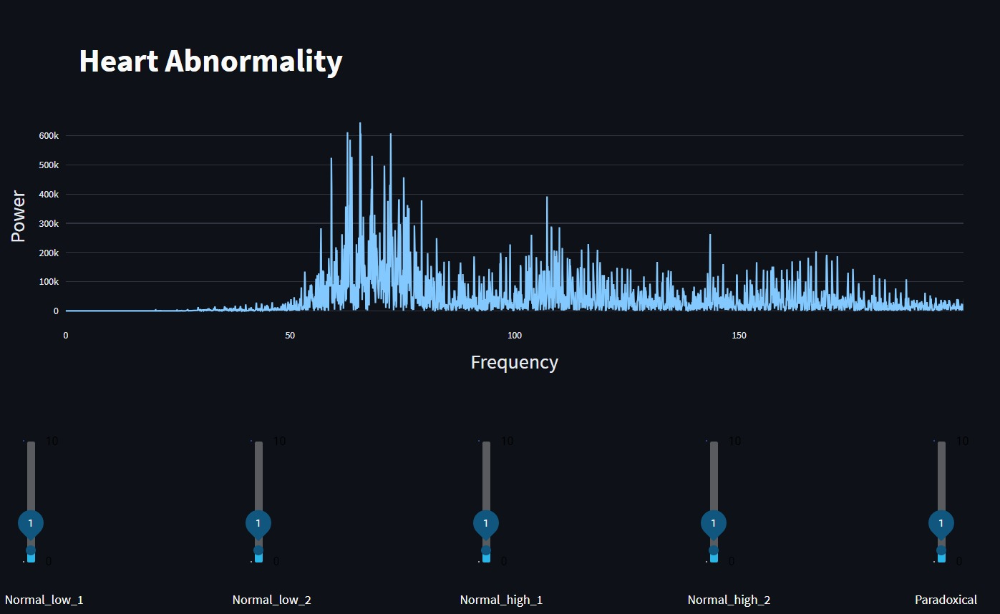
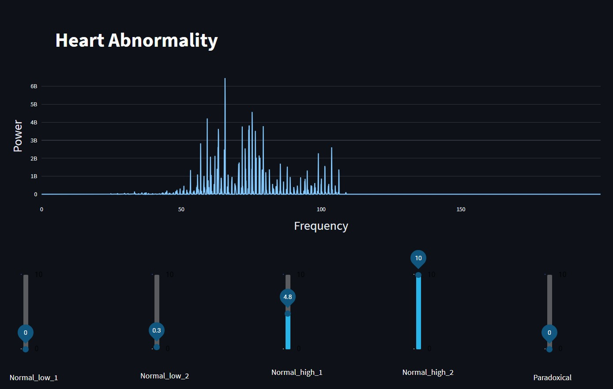
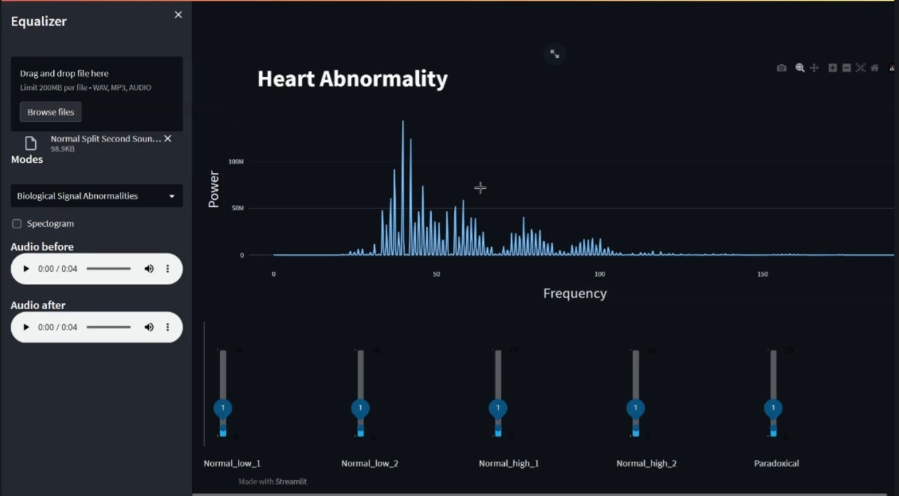
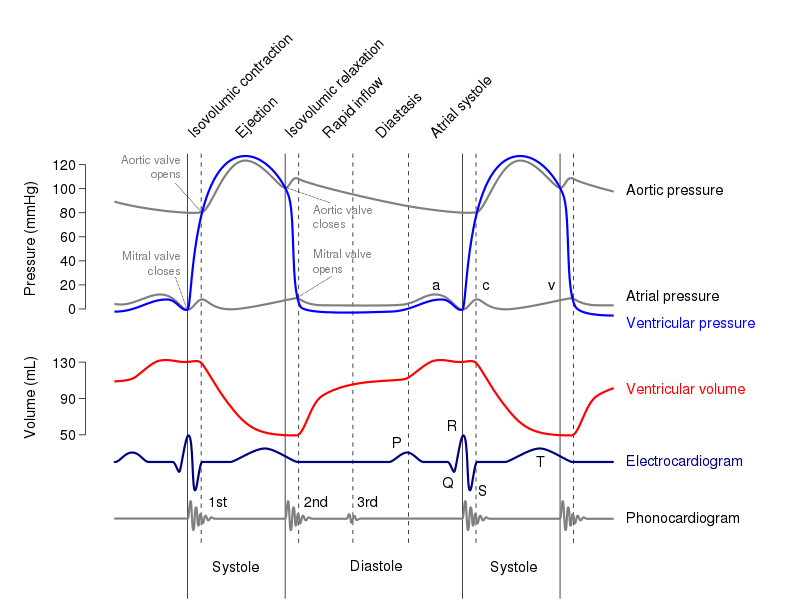
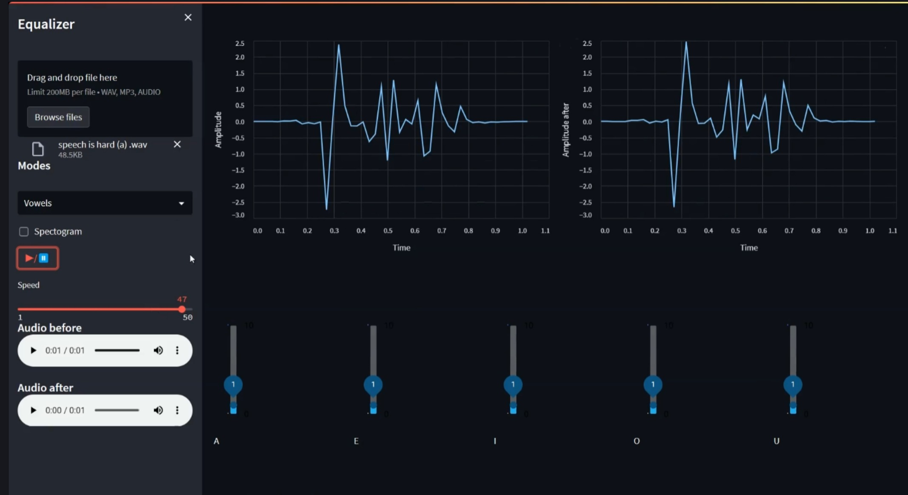

# Equalizer Web Application

## Introduction

The Equalizer Web Application is a tool designed for signal processing in the music and speech industry. It also finds applications in various biomedical scenarios, such as hearing aid abnormalities detection. 

## 🎥 [Watch the Demo Video](https://clipchamp.com/watch/Mo0L2R7mFch)

## Description

The goal of this project is to develop a web application that allows users to open a signal, manipulate the magnitude of specific frequency components through sliders, and reconstruct the modified signal. The application offers different working modes:

### 1. **Uniform Range Mode:** Divides the total frequency range of the input signal into 10 equal ranges, each controlled by a slider.

   
   
   

### 2. **Biological Signal Abnormalities:** Permits users to control the magnitude of specific abnormalities (e.g., ECG arrhythmia) in the input biological signal.

 
   

### 3. **Musical Instruments Mode:** Allows users to control the magnitude of specific musical instruments in the input music signal.

### 4. **Vowels Mode:** Enables users to control the magnitude of specific vowels in the speech signal.

 
   
Users can easily switch between modes, and the user interface (UI) adapts to display relevant sliders for each mode. The UI includes two signal viewers for input and output signals, synchronized in time, and two spectrograms that reflect changes made through the equalizer sliders.

## Features

- **Slider Controls:** Sliders for adjusting frequency components in different modes.
- **Signal Viewers:** Two synchronized signal viewers for input and output signals.
- **Spectrograms:** Toggleable spectrograms for visualizing signal changes.
- **Mode Switching:** Easily switch between Uniform Range, Vowels, Musical Instruments, and Biological Signal Abnormalities modes.

## Validation

To validate the application, each group should prepare a synthetic signal file. This artificial signal, composed of pure single frequencies, helps track the impact of equalizer actions on each frequency.

## Usage

1. **Upload File:** Use the file uploader in the sidebar to select a .wav, .mp3, or .audio file.
2. **Choose Mode:** Select a mode from the sidebar dropdown menu (Uniform Range, Vowels, Music Instruments, Biological Signal Abnormalities).
3. **Adjust Sliders:** Manipulate the sliders to modify frequency components based on the chosen mode.
4. **View Signals:** Observe changes in the input and output signals in the synchronized signal viewers.
5. **Toggle Spectrograms:** Optionally, toggle the display of spectrograms to visualize signal changes.

## Requirements

- Python 3.x
- Streamlit
- Pandas
- Soundfile

## Completion Status
The task has been successfully completed. The application meets the specified requirements, providing a user-friendly interface for manipulating signal frequencies in different modes.

### Note:
Ensure that you have the necessary dependencies installed and follow the user documentation for a smooth experience with the Equalizer Web Application.

## Getting Started
1. Clone the repository.
2. Install dependencies (provide a list if applicable).
3. Run the application.
4. Load a signal file and start exploring the different modes.

## How to Run

1. Install the required libraries: `pip install streamlit pandas soundfile`
2. Run the application: `streamlit run your_app_file.py`

## Acknowledgments

This project was developed using Streamlit, a powerful Python library for creating web applications with minimal code.

---

Replace "your_app_file.py" with the actual filename of your Streamlit application. You can include additional sections or details based on the specific requirements of your project.

## Contact me!

For any issues or questions, contact Mahmoud Mansy at [mmansy132003@gmail.com].

Thank you for using the Equalizer Web Application!

