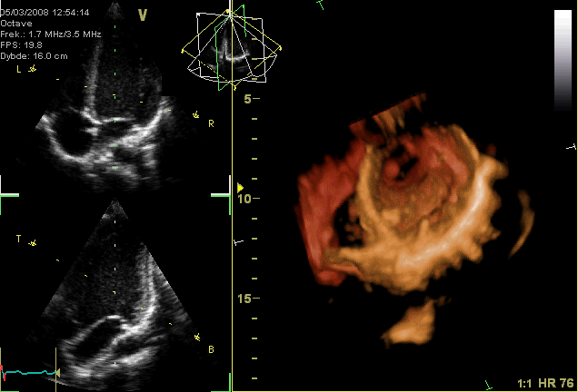

# Equalizer Web Application

## Overview
The Equalizer Web Application is a versatile tool designed for manipulating signal frequencies in various modes. This application is particularly useful in the music and speech industry, as well as in biomedical applications such as abnormality detection in hearing aids and ECG arrhythmia.

## Task Description
Develop a web application that allows users to open a signal and adjust the magnitude of specific frequency components through sliders. The application should be capable of operating in different modes:
### [![Watch the Demo Video]](Vedio/Vedio.mp4)
1. **Uniform Range Mode:** Divide the total frequency range of the input signal into 10 equal ranges, each controlled by a slider in the UI.
   
   
   
2. **Vowels Mode:** Enable control over the magnitude of specific vowels in speech signals.
3. **Musical Instruments Mode:** Adjust the magnitude of specific musical instruments in the input music signal.
4. **Biological Signal Abnormalities:** Control the magnitude of specific abnormalities (e.g., ECG arrhythmia) in the input biological signal.
   
   
   
   

## Features
- Seamless switching between modes through an option menu or combobox.
- Two signal viewers (input and output) that run synchronously, allowing users to scroll or zoom while maintaining alignment.
- Play/stop/pause/speed-control panel for controlling the signals.
- Boundary condition handling in signal viewers to prevent scrolling beyond start or end points and outside signal amplitude limits.
- Two spectrograms (input and output) that dynamically update based on equalizer slider adjustments.
- Option to toggle the visibility of spectrograms.

## Validation
To validate the application, prepare a synthetic signal file—a composite of pure single frequencies. This synthetic signal will assist in tracking the impact of equalizer actions on each frequency. The composition of frequencies is at the discretion of each group, with the goal of assessing the equalizer's accuracy.

## Completion Status
The task has been successfully completed. The application meets the specified requirements, providing a user-friendly interface for manipulating signal frequencies in different modes.

### Note:
Ensure that you have the necessary dependencies installed and follow the user documentation for a smooth experience with the Equalizer Web Application.

## Getting Started
1. Clone the repository.
2. Install dependencies (provide a list if applicable).
3. Run the application.
4. Load a signal file and start exploring the different modes.

For any issues or questions, contact Mahmoud Mansy at [mmansy132003@gmail.com].

Thank you for using the Equalizer Web Application!
